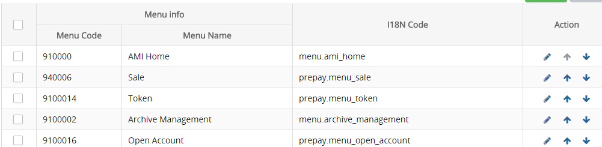
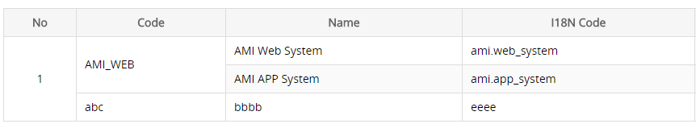

># ami-web-api

>## 环境安装

1.安装node

```bash
    https://nodejs.org/zh-cn/
```

2.安装淘宝镜像 

```bash
	npm install -g cnpm –registry=https://registry.npm.taobao.org
```

3.安装依赖包

```bash
	cnpm install
```

4.运行项目

```bash
	cnpm run dev
```

>## 模块编写步骤

1.创建模块文件夹


2.创建模块路径 ``router.js`` 文件

```js
    /**无子菜单
	   文件路径：views/frame/user_management/menu/router.js
    **/
	import Menu from './index'
	let router = {
        path: '/user/menu',
        meta: {
            code: "MENU" //菜单权限码，必须有
        }, 
        component: Menu
    };

    //有子菜单
    import meteringPoint from './index'
    import show from './show'

    let router = {
        path: '/archive/metering_point',
        meta: {
            code: "METER_POINT"
        },
        component: {
            template: "<router-view></router-view>"
        },
        children: [{ //主页面
            path: "",
            component: meteringPoint
        },{
            path: ":pointId", //详情页面
            component: show
        }]
    };

	export default router
```

3.加载模块路径到项目

```js
    //文件路径：views/frame/router.js

	//menu 
	import router_menu from './user_management/menu/router.js'

	let router = {
        path: '/frame',
        component: {
            template: '<router-view></router-view>'
        },
        redirect:'',
        children: [
            router_user,
            router_menu //添加到项目
        ]
    };
```

4.修改菜单路径

在User Management > menu功能下修改当前模块菜单的 ``Parameter Info`` 字段, 例如 Menu 修改为 ``/user_management/menu``, 刷新项目

>## 国际化

ami-web使用 ``vue-i18n`` 国际化工具

```html
	<span>{{ $t("meter_statistic.account_no")}}</span>
```

>## 组件

### 按钮组

```html 
    <!-- 更多搜索: target指向更多容器id -->  
    <ami-button type="search" :on-click="getPointList" target="showmore"></ami-button>
    <div id="showmore" class="folder hide">
    </div>


    <!-- 导出(含Excel、PDF导出选项) -->
    <ami-button type="export" :on-click="exportData"></ami-button>
    //type取值：EXCEL、PDF
    exportData(type){ 
        //导出
    }
```

### 下拉菜单 Dropdown

当前的下拉菜单采用elementUI的Dropdown组件, 可自行前往查看文档 http://element.eleme.io/#/zh-CN/component/dropdown

示例: 

```html   
     <el-dropdown>
        <button type="button" class="blue">
            {{ $t("common.button.import")}}
            <i class="el-icon-arrow-down el-icon--right"></i>
        </button>
        <el-dropdown-menu slot="dropdown">
            <el-dropdown-item><div v-on:click="showUploadDialog(1)">Import All</div></el-dropdown-item>
            <el-dropdown-item><div v-on:click="showUploadDialog(2)">Import MeteringPoint-Meter</div></el-dropdown-item>
        </el-dropdown-menu>
    </el-dropdown>
```

结果: 


### select

```html
    <!-- 当列表项中有国际化信息i18nCode时，会取该值进行国际化，不会采用label -->
    <ami-select :data="list" prop="type" label="name" 
        class-name="T-meter_type"  v-model="activePoint.meterType">
    </ami-select>
```

可搜索

```html
    <ami-select :data="list" prop="type" label="name"  filter
        class-name="T-meter_type"  v-model="activePoint.meterType">
    </ami-select>
```

<p class="tip"> 参数说明</p>

键|值类型|说明|可取值|默认值
-|-|-|-|-
data|Array|数据列表|| 
prop|String|读取字段|| id
label|String|下拉框展示字段,默认会去读取i18nCode进行国际化|| name
type|String|数据字典key, 只在列表为数据字典数据时有效<br />数据字典不需要设置label和prop||
filter|Boolean|是否可搜索||true 
clear|Boolean|是否可清除选择||false 
multiple|Boolean|是否可多选||false
class-name|String|input框的样式class|| 
all|Boolean|是否显示"All"项||
disabled|Boolean|下拉框是否可选择||true
on-select|Function(item)|选择一个项是触发的方法||

#### 数据字典

1.获取数据字典列表

```html
    <!-- 通过设置 ami-select 的 type 获取数据字典列表 -->
    <ami-select class-name="T-meter_type" type="METER_TYPE" filter
        v-model="activePoint.meterType">
    </ami-select>
```

2.filter: 名字取数据字典key

```html
    {{ item.planMeterType | METER_TYPE }}

    <!-- 输入框使用filter -->
    <input type="text" :value="item.planMeterType | METER_TYPE" />
```

### 树 ami-tree

1.下拉树

```html
    <ami-tree :data="funList" label="name" prop="funCode" 
        v-model="activeMenu.funcCode" 
        :on-select="clickFunction" 
        selection>
    </ami-tree>
```

2.左侧树

```html
    <ami-tree fixed :data="menuTree" prop="menuCode" 
        v-model="searchData.parentCode"  
        :on-select="clickFunction" >
    </ami-tree>
```

2.可选择树

```html
    <ami-tree :data="funList" checkbox
        v-model="activeMenu.permissionIds"
        :on-select="funSelect">
    </ami-tree>
```

可通过设置每一项项的icon属性来自定义节点样式(需添加样式)。

<p class="tip"> ami-col参数说明</p>

键|值类型|说明|可取值|默认值
-|-|-|-|-
fixed|Boolean|是否为左侧树|| false
type|String|树类型,默认为普通树|region(区域树)|
url|String|区域树节点数据请求地址|| "/user-service/regions/tree/user.json"
data|Array|下拉树数据||
label|String|下拉树选择节点后用于显示的字段|| name
prop|String|下拉树选择节点后需要获取的字段|| id
placeholder|String|搜索框默认提示语||区域树取值"Region/TR"，其他默认为空
selection|Boolean|是否为下拉树|| false
filter|Boolean|是否可搜索||false(下拉树时始终为true) 
clear|Boolean|是否可清除选择||false 
checkbox|Boolean|是否可勾选|| false
layout|Object|树样式对象,在左侧树时定位需要用到|top,left|
class-name|String|当树为下拉树时，input框的样式class||
disabled|Boolean|控件是否可操作||
default-click|Boolean|是否默认点击树的第一个节点，目前仅在区域树有效||true
on-select|Function|节点选中事件(点击或勾选),当树为非左侧树时需要通过返回一个布尔值来通知组件当前节点是否符合要求||
on-expand|Function|当前节点子节点加载方法(树结构已内置)||
render-content|Function|自定义节点显示||
authorization|Boolean|区域树是都按用户权限显示,值为true时区域树默认调用"/user-service/regions/tree/user.json"接口获取，值为true时区域树默认调用"/user-service/regions/tree/all.json"接口获取|| true
level|String|区域树可选择的节点类型|| 
devices|Boolean|区域树是否显示设备节点||false
device-search|Boolean|区域树是否可精确搜索设备||false
backup-key|String|存在该值时树优先获取该字段，无值时调用prop||


### 表格 ami-table

<p class="tip"> ami-table参数说明</p>

键|值类型|说明|可取值|默认值
-|-|-|-|-
data|Object/Array|列表数据, 需要分页时为对象，其中包含分页数据，不需要分页时为数组||
max-height|Number|表格最大高度 (document.body.clientHeight: 当前窗口高度)||document.body.clientHeight  - 230
max-width|Number/String|表格最大宽度，设置后将对单元格内容进行强制折断，表格不再出现横向滚动条|像素值/百分比|
option-key|String|表格中的checkbox读取字段||
page-click|Function(page,size)|翻页函数||
high-light|Boolean|是否高亮显示当前点击行,只在表格中没有checkbox列时有效||false
slot-row|Number|你的自定义行数，方便组件判断是否需要显示分页和无数据提示||
tr-click|Function(row,index)|行点击事件||
span-method|Function(row,col,rowIndex,colIndex)|表格的单元格合并方法||

<p class="tip"> ami-col参数说明</p>

键|值类型|说明|可取值|默认值
-|-|-|-|-
type|String|列类型|index, checkbox, action<br/>取上述三值的时候, 可省略label字段,并且列会自动居中|
title|String|表头hover文字||
label|String|列头文字||
prop|String|列读取字段||
width|Number/String|列宽，可为数字或百分比||auto
maxWidth|String|设置值以后td中超出这个宽度会出现滚动条显示 例:max-width="80"||
align|String|列居中方式|left, center, right| left
fixed|String|列是否固定|left: 左侧固定,right: 右侧固定|left
sortable|Boolean|列是否可排序,可排序时必须有"sort-method"||false
"sort-method"|Function|列排序方法, 与sortable搭配完成排序功能, 接受两个参数:sortType("asc"/"desc")表示当前排序方式,prop表示当前排序列读取字段||false

#### 表格固定

通过ami-table创建的表格默认会固定表头

```html
    <!-- 表头固定 -->
	<ami-table :data="listData" :page-click="get list function" 
        option-key="checkbox key" v-model="checked list">

        <!-- fixed设置列固定 -->
        <ami-col fixed type="index"></ami-col>
        <ami-col type="checkbox" prop="menuCode"></ami-col>
        <ami-col label='Menu Code' prop="menuCode"></ami-col>
        
        <!-- fixed设置列固定 -->
        <ami-col fixed type="action">
            <template slot-scope="scope">
                <a>{{scope.row.menuCode}}</a>
                <a><i class="icon-arrow_up"></i></a>
                <a><i class="icon-arrow_down"></i></a>
            </template>
        </ami-col>
    </ami-table>
```

多行固定 && 自定义行内容
    
```html
    <!-- slot-row: 告诉组件你有几行自定义行，以方便组件判断是否需要显示分页及无数据提示 -->
    <ami-table :data="userData" :page-click="getUserList" option-key="userId" v-model="delList" slot-row="2">
        <tbody>
            <!-- 固定行 -->
            <tr class="fixed_row">
                <td>1</td>
                <td>2</td>
                <td>3</td>
            </tr>
            <!-- 不固定 -->
            <tr>
                <td>1</td>
                <td>2</td>
                <td>3</td>
            </tr>
        </tbody>
        <!-- 即使除自定义行内容外没有其他行需要显示，也需要用过设置ami-col去设置表头内容 -->
        <ami-col type="checkbox"></ami-col>
        <ami-col label='User Id' prop="userId"></ami-col>
        <ami-col :label='$t("log.user_name")' prop="username"></ami-col>
    </ami-table>
```


#### 多级表头

通过ami-col标签嵌套的方式实现多级表头

```html
    <ami-table :data="listData" :page-click="get list function" 
        option-key="checkbox key" v-model="checked list">
        <ami-col type="checkbox" prop="menuId"></ami-col>

        <!-- 多级表头 -->
        <ami-col label="Menu info">
            <ami-col :label='this.$t("permission.menu_code")' prop="menuId"></ami-col>
            <ami-col :label='this.$t("permission.menu_name")' prop="menuName"></ami-col>
        </ami-col>

        <ami-col :label='this.$t("permission.i18ncode")' prop="i18nCode"></ami-col>
        <ami-col type="action">
            <template slot-scope="scope">
                <a>{{scope.row.menuCode}}</a>
                <a><i class="icon-arrow_up"></i></a>
                <a><i class="icon-arrow_down"></i></a>
            </template>
        </ami-col>
    </ami-table>
```



#### 合并单元格

通过给table传入span-method方法可以实现合并行或列，方法的参数：当前行row、当前列column、当前行号rowIndex、当前列号colIndex。

该函数可以返回一个包含两个属性的对象，rowspan、colspan。colspan为0时不渲染单元格。

```html
    <ami-table :data="appListData" :page-click="getAppList" :span-method="testSpan">
        <ami-col type="index"></ami-col>
        <ami-col :label='$t("region.code")' prop="applicationId"></ami-col>
        <ami-col :label='$t("common.table.name")' prop="applicationName"></ami-col>
        <ami-col :label='$t("permission.i18ncode")' prop="i18nCode"></ami-col>
    </ami-table>

    //合并方法
    testSpan: function(row,col,rowIndex,colIndex){
        if(rowIndex == 0){
            if(colIndex == 0){//合并第1列的1、2、3行
                return {
                    colspan: 1,
                    rowspan: 3
                }
            } else if(colIndex == 1){//合并第2列的1、2行
                return {
                    colspan: 1,
                    rowspan: 2
                }
            }
        } else if(rowIndex == 1){
            if(colIndex == 0 || colIndex == 1){//不渲染第1列的1、2行(被合并)
                return {
                    colspan: 0
                }
            }
        } else if(rowIndex == 2){
            if(colIndex == 0){//不渲染第1列的3行(被合并)
                return {
                    colspan: 0
                }
            }
        }
    }
```



#### 表格排序

```html
    <ami-table :data="listData" :page-click="get list function" 
        option-key="checkbox key" v-model="checked list">
        <ami-col type="index"></ami-col>
        <ami-col type="checkbox" prop="menuCode"></ami-col>

        <!-- sortable 设置列可排序, 必须设置"sort-method", 否则排序无效 -->
        <ami-col label='Menu Code' prop="menuCode" sortable :sort-method="sortList"></ami-col>

        <ami-col type="action">
            <template slot-scope="scope">
                <a>{{scope.row.menuCode}}</a>
                <a><i class="icon-arrow_up"></i></a>
                <a><i class="icon-arrow_down"></i></a>
            </template>
        </ami-col>
    </ami-table>

    sortList: function(sortType,prop){
        if(sortType == "asc"){
            console.log("当前是升序排列");
        } else if(sortType == "desc"){
            console.log("当前是降序排列");
        }

        console.log("当前排序字段：" + prop);
    }
```

### 信息表格 ami-info-table

<font color=red>信息表格会自动对末项进行表格合并处理，所以不需要手动设置单元格合并</font>

#### 自定义显示内容

自定义每一项的文字描述，提供data对象，示例：ami-home --> Relay Control --> Meter

```html
    <ami-info-table col="2" :data="meterInfo">
        <ami-info-item :label="$t('event.connection_status')">
            <template slot-scope="scope">
                {{meterInfo.relayStatus | RELAY_STATUS}}
            </template>
        </ami-info-item>
        <ami-info-item :label="$t('dcu.communication')" prop="dcuNetWorkStatus"></ami-info-item>

        <ami-info-item :label="$t('customer.account_id')" prop="customerNo"></ami-info-item>
        <ami-info-item :label="$t('meter.meter_type')" prop="dcuNetWorkStatus">
            <template slot-scope="scope">
                {{meterInfo.meterType | METER_TYPE}}
            </template>
        </ami-info-item>
    </ami-info-table>
```

<p class="tip"> ami-info-table参数说明</p>

键|值类型|说明|可取值|默认值
-|-|-|-|-
data|Array/Object|数据源||
label|String|项文字描述读取字段||
prop|String|项值读取字段||
checkbox|Boolean|是否在项文字描述前显示复选框||false
option-key|String|复选框读取字段||
col|Number|每行显示几项||1
type|String|左右哪一边的内容占比比较多|left,right|left


<p class="tip"> ami-info-item参数说明</p>

键|值类型|说明|可取值|默认值
-|-|-|-|-
label|String|项文字描述||
prop|String|项从data对象读取的字段||

#### 根据列表显示

示例：ami-home --> Meter Readings --> Meter

```html
    <ami-info-table :data="banner.readingCategoryDetailViewList" col="2" 
        label="name" prop="value,unit" option-key="code" checkbox 
        v-model="meterRead[banner.code].readList">
    </ami-info-table>
```

### 时间 ami-date

1.时分

```html
    <ami-date type="time" v-model="searchData.date">
    </ami-date>
```

2.年月日

```html
    <ami-date v-model="searchData.date">
    </ami-date>
```

3.年月日 时分秒

```html
    <ami-date type="datetime" v-model="searchData.date">
    </ami-date>
```

4.年月

```html
    <ami-date type="month" v-model="searchData.date">
    </ami-date>
```

5.年

```html
    <ami-date type="year" v-model="searchData.date">
    </ami-date>
```

6.自定义时间格式

```html
    <ami-date format="dd/MM/yyyy" v-model="searchData.date">
    </ami-date>
```

8.设置时间不可选择

```html
    <!-- 2017-12-12以前的时间不可选择 -->
    <ami-date start-date="2017-12-12" v-model="searchData.date">
    </ami-date>
```

9.设置时间可清除

```html
    <ami-date clear v-model="searchData.date">
    </ami-date>
```

10.设置两个时间的最大间隔,值为"间隔时间/间隔方式", 需要设置 ``on-change`` 方法接收关联控件的值变化

```html   
    <!-- 设置最大间隔为3天 -->
    <!-- 注意: 在开始时间控件里，需设置end-date, 在结束时间控件里需设置start-date -->
    <ami-date range="3/day" v-model="searchData.endDate" 
        :end-date="searchData.startDate" :on-change="changeDate">
    </ami-date>
    <ami-date range="3/day" v-model="searchData.startDate" 
        :start-date="searchData.endDate" :on-change="changeDate">
    </ami-date>

    <!-- 注意: 在开始时间控件里，需设置end-date, 在结束时间控件里需设置start-date -->
    changeDate: function(type,siblingDate){
        if(type == "start"){
            this.searchData.startDate = siblingDate;
        } else if(type == "end"){
            this.searchData.endDate = siblingDate;
        }
    }
```

11.设置默认时间, 使用``default-date``设置,值为"间隔时间/间隔方式

```html  
    <!-- 设置默认时间为前一天 -->
    <ami-date v-model="searchData.freezeDate" default-date="-1/day"></ami-date>

    <!-- 设置默认时间为后一天 -->
    <ami-date v-model="searchData.freezeDate" default-date="1/day"></ami-date>

    <!-- 设置默认时间为前一个月 -->
    <ami-date v-model="searchData.freezeDate" default-date="-1/month"></ami-date>

    <!-- 设置默认时间为前一年 -->
    <ami-date v-model="searchData.freezeDate" default-date="-1/year"></ami-date>
```


<p class="tip"> 参数说明</p>

键|值类型|说明|可取值|默认值
-|-|-|-|-
type|String|时间控件类型|time(可选择时分), date(可选择日期), datetime(可选择日期和时分), month(可选择年月), year(只可选择年)| date
format|时间格式| yyyy(年), MM(月), dd(日), HH(小时), mm(分), ss(秒),AM/PM A|| time --> (HH:mm)<br/>date --> (yyyy-MM-dd)
minute-step|Number|分钟间隔||
default-date|Number/String|控件默认时间|| 
start-date|Date/String|可选择的最小时间|| 
end-date|Date/String|可选择的最大时间|| 
range|Number/String|两个时间控件值最大间隔|| 
on-change|Function|选择时间后回调函数, 通常在需要时间间隔时使用<br/>三个参数: <br/>type --> 当前需要修改的是开始时间还是结束(start/end)<br/> siblingDate --> 关联的时间控件此时该有的值||
clear|Boolean|是否可清除选择|| false
class-name|String|时间控件class|| 
placeholder|String|文本框占位符||
disabled|Boolean|是否可选择时间||false

### 图表


```html
    <ami-chart type="collectionStatus" :option="collectionStatusOption"
        :format-tooltip="getTooltip" :data="collectionChartData" 
        :on-click="paramDataReturn">
    </ami-chart>
```
<p class="tip"> 参数说明</p>

键|值类型|说明|可取值|默认值
-|-|-|-|-
chart-type|String|图表类型||
type|String|图表类型,用于读取options.json中的配置信息|| 
width|Number|图表宽度||
height|Number|图表高度||
i18n|Boolean|文字是否需要国际化||
option|Object|图表配置|| 
data|Array|图表具体数据||
on-click|Function(param)|单击事件|| 
format-tooltip|Function|图表tooltip内容自定义|| 
legend-reset||当该数据变化时重置图例选择||
resize|Boolean|是否重新渲染图表|


### 地图

1.谷歌

```html
    <ami-map :single-click="getEventDetail" :height="mapHeight"></ami-map>
```
<p class="tip"> 参数说明</p>

键|值类型|说明|可取值|默认值
-|-|-|-|-
center|Array|地图中心点|| 
zoom|Number|地图默认缩放值|| 6
max-zoom|Number|地图最大缩放值|| 18
min-zoom|Number|地图最小缩放值|| 2
height|Number|地图组件高度|| 
devices|Array|需要渲染的设备列表||
show-devices|String|是否在地图上显示设备点|always： 总是,only-after-zooming-in: 仅在地图缩放值>=14时显示设备|always 
single-click|Function(deviceKey,deviceType)|地图点单击事件|| 
download|Boolean|是否在地图上显示截图下载按钮||false
styleType|String|设备点的显示方式|circle: 设备显示为一个圆点，其他： 设备显示类型对应图标| 
label-fomatter|Function(type,device,index)|设备的文字渲染，type: transformer/device||

2.openlayers

```html
    <ami-map-openlayers :single-click="getEventDetail" :height="mapHeight"></ami-map-openlayers>
```
<p class="tip"> 参数说明</p>

键|值类型|说明|可取值|默认值
-|-|-|-|-
center|Array|地图中心点|| 
zoom|Number|地图默认缩放值|| 10
height|Number|地图组件高度|| 
devices|Array|需要渲染的设备列表||
show-devices|String|是否在地图上显示设备点|always： 总是,only-after-zooming-in: 仅在地图缩放值>=14时显示设备|always 
single-click|Function(deviceKey,deviceType)|地图点单击事件|| 
download|Boolean|是否在地图上显示截图下载按钮||false
styleType|String|设备点的显示方式|circle: 设备显示为一个圆点，其他： 设备显示类型对应图标| 

### 链接

1.router-link

项目使用router路由工具, 具体使用方法可查看官网 https://router.vuejs.org/zh-cn/

链接示例：

```html
    <!-- 字符串 -->
    <router-link to="home">Home</router-link>
    <!-- 渲染结果 -->
    <a href="home">Home</a>

    <!-- 使用 vue 的 JS 表达式 -->
    <router-link :to="'home'">Home</router-link>
    <router-link :to="{ path: 'home' }">Home</router-link>

    <!-- 命名的路由 -->
    <router-link :to="{ name: 'user', params: { userId: 123 }}">User</router-link>

    <!-- 带查询参数, 下面的结果为 /register?plan=private -->
    <router-link :to="{ path: 'register', query: { plan: 'private' }}">Register</router-link>
```

2.a标签, 使用a标签创建链接时, 如果没有路径不要写 ``href="#"``,以避免出现路径错误

### Loding & 消息提示 & 弹窗

Loading 文档地址: http://element.eleme.io/#/zh-CN/component/loading

Message 消息提示

```js
    //普通消息
    this.$message('这是一条消息提示');

    //成功
    this.$message({
        message: '恭喜你，这是一条成功消息',
        type: 'success'
    });

    //警告
    this.$message({
        message: '警告哦，这是一条警告消息',
        type: 'warning'
    });

    //错误
    this.$message.error('错了哦，这是一条错误消息');
```

操作确认框

```js
    /**确认框(删除等操作前提示确认用)
       msgOrType提示消息或者提示类型，为类型时取值: "delete" --> 删除提示
       confirmFn确认后操作函数，cancelFn取消后操作函数(可省略)
    **/
    this.$showConfirm(msgOrType,confirmFn,cancelFn)

    this.$showConfirm("delete",function(){
        console.log("您确认了要删除这些信息");
    },function(){
        console.log("您取消了删除这些信息");
    });

    this.$showConfirm("这是我自定义的提示信息",function(){
        console.log("您确认了要删除这些信息");
    },function(){
        console.log("您取消了删除这些信息");
    });
```

Dialog 对话框 示文档地址: http://element.eleme.io/#/zh-CN/component/dialog
    
### 上传 ami-upload

```html
	<ami-upload title="import" v-model="showUpload" :settings="uploadSettings"></ami-upload>
```

<p class="tip"> 参数说明</p>

键|值类型|说明|可取值|默认值
-|-|-|-|-
title|String|弹框头部文字||
class-name|String|控件class||
settings|Object|上传设置：url --> 上传路径，templateUrl --> 模板下载路径，success(result) --> 导入成功处理，error(error) --> 导入失败处理 ||
type|String|上传控件的显示方式|默认：以弹窗的方式显示；form：以表单项的方式显示|
file-type|Array|可接收的文件类型||["xls","xlsx"]
file-size|Number|可接收的文件最大值(M)||10
update-selected|Function(fileList)|选择或删除文件时的处理方法||

>## http请求

ami-web使用 ``axios`` 请求处理工具

请求根地址：http://10.32.233.110:8888/ami, 可通过 ``this.$axios.baseUrl`` 获取

1.get

```js
	this.$axios.get({
        url: "/menu/queryMenuTree.json",
        data: data,
        loading: true, //是否需要显示loading,默认不显示，显示时默认timeout为5分钟
        timeout: 5 * 60 * 2000, //请求超时时间,默认值为1分钟,有loading时默认值为5分钟 , 设置为0则没有超时限制，直到请求返回结果为止
        success: function (result) {
            if(_this.checkAjax(result)){
                _this.menuTree[0].children = result.data;
            }
        }
    });
```

2.post

```js
	this.$axios.post({
        url: method,
        data: _this.activeMenu,
        success: function(data){
            if(_this.checkAjax(data,true)){
                
            }
        }
    });
```

3.put

```js
    this.$axios.put({
        url: method,
        data: _this.activeMenu,
        success: function(data){
            if(_this.checkAjax(data,true)){
                
            }
        }
    });
```

4.delete(只接受简单类型的数据)

```js
    this.$axios.delete({
        url: method,
        data: _this.activeMenu,
        success: function(data){
            if(_this.checkAjax(data,true)){
                
            }
        }
    });
```

5.checkAjax 检查请求结果

```js
	this.checkAjax(data,true)
```

data为返回数据,true代表提示请求结果, 不提示不传

>## 全局对象/方法

### 对象 & 属性

1.接口请求根路径``this.$axios.baseUrl``

2.Access Token``this.$store.state.token``

```js
    computed: {
        token(){
            return this.$store.state.token;
        }
    }
```

3.当前登录用户 ``this.$store.state.user``

```js
    computed: {
        token(){
            return this.$store.state.user;
        }
    }
```

4.钱币单位

```js
    computed: {
        //纯单位
        moneyUnit(){
            return this.$store.state.moneyUnit;
        },
        //带括号 
        moneyUnit2(){
            return this.$store.getters["config/moneyUnit"];
        } 
    }
```

5.导出根地址 ``this.$store.getters["config/reportUrl"]``

6.地图类型 ``this.$store.getters["config/mapType"]``


### 方法

1、数字格式化filter

```html
    <!-- NUM(value,floatLength)  floatLength: 小数点保留位数-->
    {{maxRecharge | NUM(floatLength)}}
    <!-- 以下结果为12,125.00 -->
    {{12125 | NUM(2)}}
```

2、导出

```js
    <!-- 导出地址 & 查询参数 -->
    this.$export(url,data);
    this.$export("/prepay/logoff/history/export.json",this.search);
```

3.获取服务器时间``this.$getServerDate``

4.判断当前用户是否有该功能权限 ``this.$checkPermission(code)``

5.获取指定数据字典数据项列表``this.$getDictionary(dictionaryType)``

6.千分位格式化``this.$thousandPoint(num,floatLength)``

7.退出登录``this.$store.dispatch("logout")``

8、跳转到主页``this.$store.dispatch('toHome')``