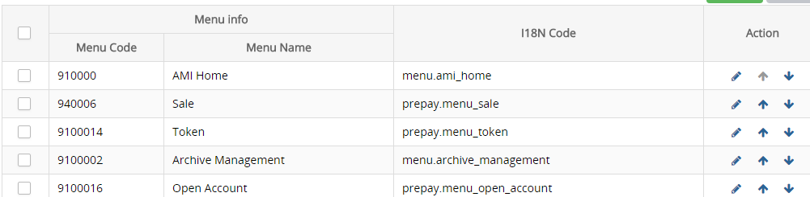
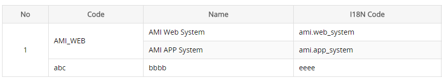

>## Table 表格

```html
    <!-- 分页 -->
    <ami-table :data="listData" :max-height="tableHeight" 
        :page-click="get list function" option-key="checkbox key" v-model="checked list">
        <!-- 序列, 默认居中 -->
        <ami-col type="index"></ami-col>
        <!-- 复选框, 默认居中 -->
        <ami-col type="checkbox" prop="menuCode"></ami-col>
        <ami-col label='Menu Code' prop="menuCode"></ami-col>
        <!-- 操作列, 默认居中 -->
        <ami-col type="action">
            <!-- 自定义内容, scope.row 为当前行数据 -->
            <template slot-scope="scope">
                <a>{{scope.row.menuCode}}</a>
                <a><i class="icon-arrow_up"></i></a>
                <a><i class="icon-arrow_down"></i></a>
            </template>
        </ami-col>
    </ami-table>

    listData: {
        <!-- 分页数据 -->
        pageNo: Number, //当前页码
        pageSize: Number, //当前每页显示数量
        startRow: Number, //起始行
        totalRow：Number, //总记录数
        totalPage: Number, //总页数
        <!-- 列表数据 -->
        pageData: Array 
    }

    <!-- 不分页，data为数组 -->
    <ami-table :data="list" :max-height="tableHeight" 
        :page-click="get list function" option-key="checkbox key" v-model="checked list">
        <ami-col type="index"></ami-col>
        <ami-col type="checkbox" prop="menuCode"></ami-col>
        <ami-col label='Menu Code' prop="menuCode"></ami-col>
        <ami-col type="action">
            <template slot-scope="scope">
                <a>{{scope.row.menuCode}}</a>
                <a><i class="icon-arrow_up"></i></a>
                <a><i class="icon-arrow_down"></i></a>
            </template>
        </ami-col>
    </ami-table>

    list: [{
        menuCode1: "testCode1"
    },{
        menuCode2: "testCode2"
    }]
```

<p class="tip"> ami-table参数说明</p>

键|值类型|说明|可取值|默认值
-|-|-|-|-
data|Object/Array|列表数据, 需要分页时为对象，其中包含分页数据，不需要分页时为数组||
max-height|Number|表格最大高度 (document.body.clientHeight: 当前窗口高度)||document.body.clientHeight  - 230
max-width|Number/String|表格最大宽度，设置后将对单元格内容进行强制折断，表格不再出现横向滚动条|像素值/百分比|
option-key|String|表格中的checkbox读取字段||
page-click|Function(page,size)|翻页函数||
high-light|Boolean|是否高亮显示当前点击行,只在表格中没有checkbox列时有效||false
slot-row|Number|你的自定义行数，方便组件判断是否需要显示分页和无数据提示||
tr-click|Function(row,index)|行点击事件||
span-method|Function(row,col,rowIndex,colIndex)|表格的单元格合并方法||

<p class="tip"> ami-col参数说明</p>

键|值类型|说明|可取值|默认值
-|-|-|-|-
type|String|列类型|index, checkbox, action<br/>取上述三值的时候, 可省略label字段,并且列会自动居中|
title|String|表头hover文字||
label|String|列头文字||
prop|String|列读取字段||
width|Number/String|列宽，可为数字或百分比||auto
maxWidth|String|设置值以后td中超出这个宽度会出现滚动条显示 例:max-width="80"||
align|String|列居中方式|left, center, right| left
fixed|String|列是否固定|left: 左侧固定,right: 右侧固定|left
sortable|Boolean|列是否可排序,可排序时必须有"sort-method"||false
"sort-method"|Function|列排序方法, 与sortable搭配完成排序功能, 接受两个参数:sortType("asc"/"desc")表示当前排序方式,prop表示当前排序列读取字段||false

#### 表格固定

通过ami-table创建的表格默认会固定表头

```html
    <!-- 表头固定 -->
    <ami-table :data="listData" :page-click="get list function" 
        option-key="checkbox key" v-model="checked list">

        <!-- fixed设置列固定 -->
        <ami-col fixed type="index"></ami-col>
        <ami-col type="checkbox" prop="menuCode"></ami-col>
        <ami-col label='Menu Code' prop="menuCode"></ami-col>
        
        <!-- fixed设置列固定 -->
        <ami-col fixed type="action">
            <template slot-scope="scope">
                <a>{{scope.row.menuCode}}</a>
                <a><i class="icon-arrow_up"></i></a>
                <a><i class="icon-arrow_down"></i></a>
            </template>
        </ami-col>
    </ami-table>
```

多行固定 && 自定义行内容
    
```html
    <!-- slot-row: 告诉组件你有几行自定义行，以方便组件判断是否需要显示分页及无数据提示 -->
    <ami-table :data="userData" :page-click="getUserList" option-key="userId" v-model="delList" slot-row="2">
        <tbody>
            <!-- 固定行 -->
            <tr class="fixed_row">
                <td>1</td>
                <td>2</td>
                <td>3</td>
            </tr>
            <!-- 不固定 -->
            <tr>
                <td>1</td>
                <td>2</td>
                <td>3</td>
            </tr>
        </tbody>
        <!-- 即使除自定义行内容外没有其他行需要显示，也需要用过设置ami-col去设置表头内容 -->
        <ami-col type="checkbox"></ami-col>
        <ami-col label='User Id' prop="userId"></ami-col>
        <ami-col :label='$t("log.user_name")' prop="username"></ami-col>
    </ami-table>
```


#### 多级表头

通过ami-col标签嵌套的方式实现多级表头

```html
    <ami-table :data="listData" :page-click="get list function" 
        option-key="checkbox key" v-model="checked list">
        <ami-col type="checkbox" prop="menuId"></ami-col>

        <!-- 多级表头 -->
        <ami-col label="Menu info">
            <ami-col :label='this.$t("permission.menu_code")' prop="menuId"></ami-col>
            <ami-col :label='this.$t("permission.menu_name")' prop="menuName"></ami-col>
        </ami-col>

        <ami-col :label='this.$t("permission.i18ncode")' prop="i18nCode"></ami-col>
        <ami-col type="action">
            <template slot-scope="scope">
                <a>{{scope.row.menuCode}}</a>
                <a><i class="icon-arrow_up"></i></a>
                <a><i class="icon-arrow_down"></i></a>
            </template>
        </ami-col>
    </ami-table>
```



#### 合并单元格

通过给table传入span-method方法可以实现合并行或列，方法的参数：当前行row、当前列column、当前行号rowIndex、当前列号colIndex。

该函数可以返回一个包含两个属性的对象，rowspan、colspan。colspan为0时不渲染单元格。

```html
    <ami-table :data="appListData" :page-click="getAppList" :span-method="testSpan">
        <ami-col type="index"></ami-col>
        <ami-col :label='$t("region.code")' prop="applicationId"></ami-col>
        <ami-col :label='$t("common.table.name")' prop="applicationName"></ami-col>
        <ami-col :label='$t("permission.i18ncode")' prop="i18nCode"></ami-col>
    </ami-table>

    //合并方法
    testSpan: function(row,col,rowIndex,colIndex){
        if(rowIndex == 0){
            if(colIndex == 0){//合并第1列的1、2、3行
                return {
                    colspan: 1,
                    rowspan: 3
                }
            } else if(colIndex == 1){//合并第2列的1、2行
                return {
                    colspan: 1,
                    rowspan: 2
                }
            }
        } else if(rowIndex == 1){
            if(colIndex == 0 || colIndex == 1){//不渲染第1列的1、2行(被合并)
                return {
                    colspan: 0
                }
            }
        } else if(rowIndex == 2){
            if(colIndex == 0){//不渲染第1列的3行(被合并)
                return {
                    colspan: 0
                }
            }
        }
    }
```



#### 表格排序

```html
    <ami-table :data="listData" :page-click="get list function" 
        option-key="checkbox key" v-model="checked list">
        <ami-col type="index"></ami-col>
        <ami-col type="checkbox" prop="menuCode"></ami-col>

        <!-- sortable 设置列可排序, 必须设置"sort-method", 否则排序无效 -->
        <ami-col label='Menu Code' prop="menuCode" sortable :sort-method="sortList"></ami-col>

        <ami-col type="action">
            <template slot-scope="scope">
                <a>{{scope.row.menuCode}}</a>
                <a><i class="icon-arrow_up"></i></a>
                <a><i class="icon-arrow_down"></i></a>
            </template>
        </ami-col>
    </ami-table>

    sortList: function(sortType,prop){
        if(sortType == "asc"){
            console.log("当前是升序排列");
        } else if(sortType == "desc"){
            console.log("当前是降序排列");
        }

        console.log("当前排序字段：" + prop);
    }
```